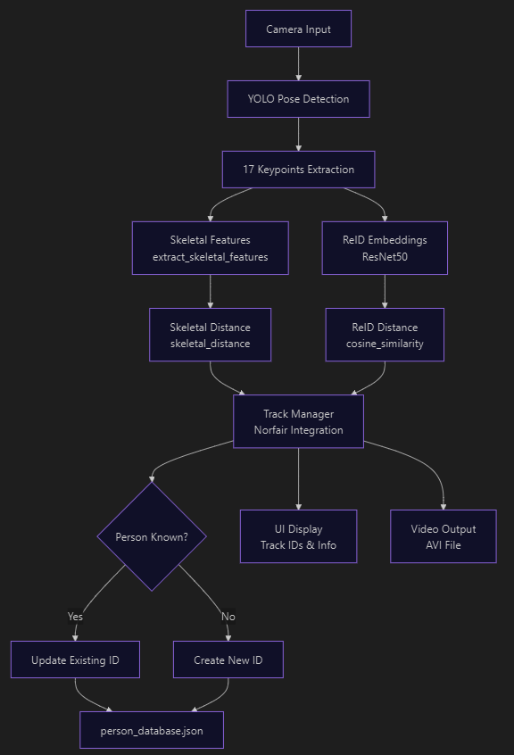

# PoseTrackAI - Advanced Skeletal Biometric Recognition System

A revolutionary real-time pose detection and tracking system that provides **permanent person identification** through advanced skeletal biometric analysis.

## What Does This Do?

This cutting-edge system detects people, tracks their movements, and **remembers them forever** using only skeletal biometric data. When someone leaves the camera and returns hours or days later, they receive the same permanent ID - regardless of clothing changes, face coverings, or appearance modifications.

**Revolutionary Approach:**
- **Pure Skeletal Recognition**: Identifies people solely by bone structure and body proportions
- **Clothing-Independent**: Works regardless of what people wear or how they dress
- **Face-Optional**: Recognition works even with masks, helmets, or face coverings
- **Permanent Memory**: Maintains identity across sessions, days, and weeks
- **Privacy-Focused**: No facial recognition or personal appearance data stored

**Core Capabilities:**
- Detects 17 body keypoints per person with high precision
- Tracks multiple people simultaneously in real-time
- **Advanced Skeletal Biometrics**: Analyzes bone structure, proportions, and gait patterns
- **Persistent Identity Management**: Assigns permanent IDs that survive across sessions
- **Multi-Camera Support**: Works with webcam, RTSP cameras, and IP streams
- **Secure Database**: Stores only skeletal features, no personal appearance data

## Development Status & Future Vision

**Current Development Phase:**
This system is currently in active development, focusing on achieving maximum stability and accuracy in skeletal biometric recognition. We are continuously refining our algorithms to ensure reliable person identification across various conditions and time periods.

**Upcoming Enhancements:**
- **Gait Analysis Integration**: Adding walking pattern analysis to further improve recognition accuracy
- **Enhanced Stability**: Implementing advanced algorithms to maintain consistent person identification
- **Multi-Modal Biometrics**: Combining skeletal data with behavioral patterns for even greater reliability
- **Real-Time Learning**: Adaptive systems that improve recognition accuracy over time

## System Architecture & Data Flow

<div align="center">
  
  <p><em>PoseTrackAI Sistem Mimarisi ve Veri Akış Şeması</em></p>
</div>

**How It Works:**
1. **Input**: Camera captures video frames
2. **Detection**: YOLO extracts 17 body keypoints per person
3. **Feature Extraction**: 
   - Skeletal biometrics (bone structure analysis)
   - ReID embeddings (appearance features)
4. **Matching**: Compare new features with stored person database
5. **Decision**: Assign existing ID or create new permanent ID
6. **Storage**: Update persistent database with new skeletal data
7. **Output**: Display tracking results and save video

## Quick Start

### 1. Clone Repository

```bash
git clone https://github.com/anilyagizbasaran/PoseTrackAI.git
cd PoseTrackAI
```

### 2. Install Dependencies

```bash
pip install opencv-python ultralytics torch torchvision norfair
```

### 3. Run Detection

**Webcam:**
```bash
python pose_ultralytics.py
```

**RTSP Camera:**
```bash
# First, edit config_rtsp.yaml with your camera URL
python pose_rtsp.py
```

### 4. Keyboard Controls

- `Q` or `ESC` - Exit
- `P` - Pause/Resume
- `F` - Fullscreen
- `W` - Normal window

## Configuration

- **config_webcam.yaml** - Webcam settings (resolution, tracking, ReID)
- **config_rtsp.yaml** - RTSP camera settings

Edit these files to adjust performance, tracking sensitivity, and person recognition.

## Project Files

```
Main Scripts:
  pose_ultralytics.py    - Webcam detection
  pose_rtsp.py           - RTSP camera detection

Base System:
  pose_base.py           - Common code base 

Core Modules:
  tracking/              - Modular tracking system
    skeletal_biometrics  - Bone structure matching
    reid_extractor       - ReID embeddings (ResNet50)
    track_manager        - Main tracking logic
  person_database.py     - Person database (JSON storage)

Utilities:
  pose_utils.py          - Pose calculations
  ui.py                  - Screen display
  log.py                 - Logging
  camera_rtsp.py         - RTSP management
  config_manager.py      - Config loader

Configuration:
  config_webcam.yaml     - Webcam settings
  config_rtsp.yaml       - RTSP settings
```

## Output

- **Video**: `yolo11_object_pose_output.avi` or `rtsp_pose_output.avi`
- **Logs**: `logs/yolo_detection.log`
- **Database**: `person_database.json` (person embeddings)

## Documentation

For detailed information, features, and troubleshooting:
- [English Documentation](DOCUMENTATION_EN.md)
- [Turkish Documentation](DOCUMENTATION_TR.md)

## Known Issues

**Person ID & Recognition Issues:**

The current implementation has some challenges with person identification and tracking:

- **Embedding Update Rate**: The exponential moving average (alpha=0.9) is too aggressive, causing person embeddings to drift over time and potentially lose original identity
- **Skeletal Weight Tuning**: Adaptive weighting between skeletal biometrics and ReID needs optimization for different scenarios
- **ID Persistence**: Person IDs may not remain stable across long sessions or when people change appearance (clothing, accessories)
- **Threshold Sensitivity**: Similarity thresholds (both skeletal and embedding) need fine-tuning for different environments and lighting conditions
- **Performance**: Auto-save on every update can cause slowdowns during high-frequency tracking
- **Database Management**: Missing export/import features and statistics tools make it difficult to manage the person database

**We welcome contributions to improve these issues!** See the Contributing section below.

## Contributing

We'd love your help improving PoseTrackAI! Here are areas where contributions would be especially valuable:

### Priority Issues:
- **Person Re-identification**: Improving the stability and accuracy of person recognition across sessions
- **Parameter Tuning**: Finding optimal values for embedding alpha, skeletal weights, and similarity thresholds
- **Database Tools**: Adding export/import functionality and management utilities
- **Performance**: Implementing batch saving or periodic database updates
- **Testing**: Creating test cases for different scenarios and edge cases

### How to Contribute:
1. Fork the repository
2. Create a feature branch (`git checkout -b feature/improvement`)
3. Make your changes and test thoroughly
4. Commit with clear messages (`git commit -m 'Fix: Improve person ID stability'`)
5. Push to your branch (`git push origin feature/improvement`)
6. Open a Pull Request

### Guidelines:
- Document your changes clearly
- Include comments in Turkish or English
- Test with both webcam and RTSP sources
- Update configuration files if adding new parameters

**Questions or ideas?** Open an issue on [GitHub](https://github.com/anilyagizbasaran/PoseTrackAI/issues)